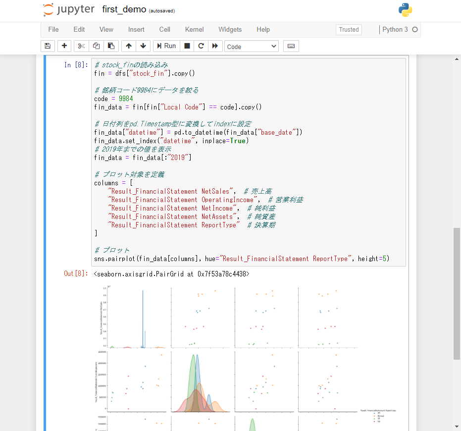
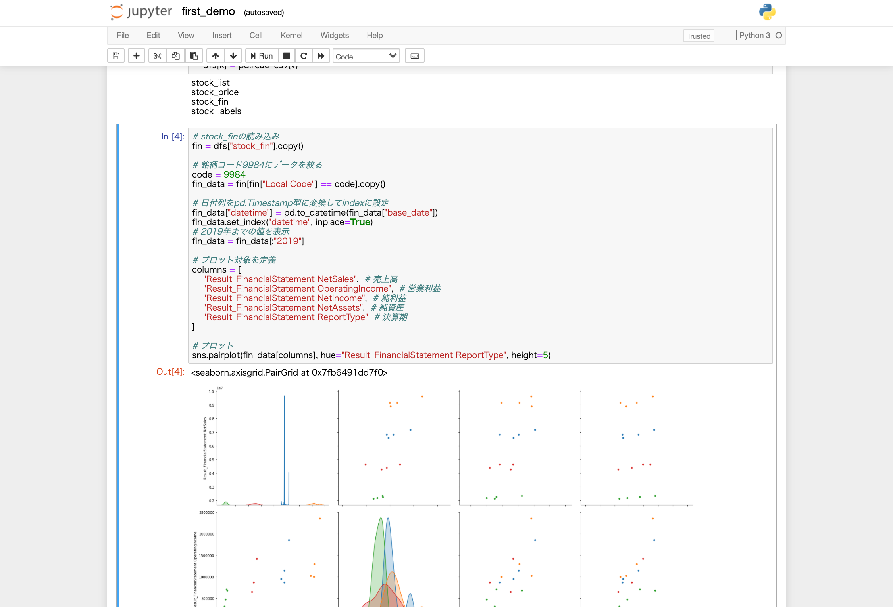

# vagrant-for-J-Quants-Tutorial

Run env with Vagrant + Docker + Docker Compose for [J-Quants-Tutorial](https://japanexchangegroup.github.io/J-Quants-Tutorial/)

Vagrant + Docker + Docker Compose で構築した、 [J-Quants-Tutorial](https://japanexchangegroup.github.io/J-Quants-Tutorial/) を実行するための環境です。

## TL; DR

### Start

1. `git clone --recursive https://github.com/dogwood008/vagrant-for-J-Quants-Tutorial.git && cd vagrant-for-J-Quants-Tutorial && mkdir -p J-Quants-Tutorial/handson/data_dir`
1. [CSVをダウンロード](https://signate.jp/competitions/423/data)
1. `./J-Quants-Tutorial/handson/data_dir` に `*.csv.gz` をコピー
1. `cp first_demo.ipynb J-Quants-Tutorial/handson/`
1. `vagrant up`
1. `vagrant ssh`
1. `cd ./J-Quants-Tutorial/handson && docker-compose up`
1. [`http://localhost:8888`](http://localhost:8888)
1. `first_demo` を開いて `Cell` → `Run All`

### Terminate

1. `Ctrl + C`
1. `Ctrl + D`
1. `vagrant halt`


## これは何か？

株式会社日本取引所グループ様が公開されている[株式分析チュートリアル](https://japanexchangegroup.github.io/J-Quants-Tutorial/)を、できるだけ誰でも簡単に実行できる環境を素早く用意することができるようにするためのリポジトリです。

## なぜこれを使うのか？どのように有用なのか？

「環境のセットアップには興味が無い」「はやくチュートリアルに取りかかりたい」「しょうもないところで躓きたくない」という方におすすめです。

環境のセットアップはこちらでやっておいたので、多少の時間とスペックを引き換えに、手っ取り早くチュートリアルを始めることができます。

このリポジトリは、下記のような理由で、 [dogwood008](https://github.com/dogwood008) により作成されました。

* セットアップで躓きやすい部分の排除
* このリポジトリを使えば、だいたいのどんな環境 (Win, mac, Linux) にこのリポジトリとチュートリアルで作ったPythonスクリプトを持って行っても、同じように実行できるようにするため
* 作った環境が壊れた時も、すぐに何度も作り直すことができるようにするため


## 使い方 - 初回のみ実行

### Vagrant のセットアップ

#### Vagrant のダウンロードとインストール

Windows, Linux の人は公式へどうぞ。
https://www.vagrantup.com/downloads

mac の人は、 [`brew install --cask vagrant`](https://formulae.brew.sh/cask/vagrant) でインストールをおすすめします。最近 `brew cask install` からコマンドが変わったようですね。


#### Vagrant のプラグインをインストール

Windows の人はコマンドプロンプトか Windows PowerShell （おすすめ）を開いて下記コマンドを入力。 mac の人は標準のターミナルかご自身でインストールされたコンソールから下記コマンドを入力してください。以下、それらをまとめて端末と呼ぶことにします。

`vagrant plugin install vagrant-disksize vagrant-vbguest`

今後、この `README.md` において、 `コマンドらしき文字列` が書かれていたらそれは全てコマンドかファイル名かそういった感じの意味のある文字列をさします。

#### コラム: なぜ Vagrant を使うの？ Docker + Docker Compose だけじゃだめなの？

別にダメだというわけではないですが、よくわからない躓きの排除や、[ファイルIO周りでのトラブル（遅い）](https://qiita.com/yuki_ycino/items/cb21cf91a39ddd61f484)を避けるために、間に Vagrant を噛ませています。噛ませなくても自分はわかっている！というとはスキップして大丈夫です。Linux で実行する人は不要もしれませんね。


### リポジトリのクローン

次に、このリポジトリをクローンして、カレントディレクトリをそのクローンしてきたディレクトリの中に移動します。下記を端末に入力してください。

`git clone --recursive https://github.com/dogwood008/vagrant-for-J-Quants-Tutorial.git && cd vagrant-for-J-Quants-Tutorial && mkdir -p J-Quants-Tutorial/handson/data_dir`

### CSVデータのコピー

前項の操作により、今はクローンしてきたリポジトリである `vagrant-for-J-Quants-Tutorial` がカレントディレクトリになっているはずである。

`./J-Quants-Tutorial/handson/data_dir` に [データの配布場所](https://signate.jp/competitions/423/data)から取得した `*.csv.gz` をコピーまたは移動する。この時、gzファイルを展開する必要は無い（展開しても、ハンズオンで書くコードからはそのファイルを参照しない）。

## 使い方 - 次回から

### Vagrant の仮想マシンを起動する

仮想マシンを起動して、必要なファイルをダウンロードしたり、環境を整えます。下記を端末に入力してください。なお、結構時間がかかりますし、途中大きなファイルをダウンロードします。テザリングを使っていたり、従量課金制の通信環境の人は注意してください。

`vagrant up`

仮想マシンのセットアップ ( `provision` )中では、仮想マシンのセットアップの他にも、 Docker イメージのビルドもあわせて行います。この都合により時間と通信量がかかるというからくりです。

`vagrant up` 中には、下記のようなログが表示されます。

PS C:\Project\vagrant-for-J-Quants-Tutorial> vagrant up
<details>
<summary>Bringing machine 'J-Quants-Tutorial' up with 'virtualbox' provider...</summary>

```
==> J-Quants-Tutorial: Clearing any previously set forwarded ports...
==> J-Quants-Tutorial: Clearing any previously set network interfaces...
==> J-Quants-Tutorial: Preparing network interfaces based on configuration...
    J-Quants-Tutorial: Adapter 1: nat
    J-Quants-Tutorial: Adapter 2: hostonly
==> J-Quants-Tutorial: Forwarding ports...
    J-Quants-Tutorial: 8888 (guest) => 8888 (host) (adapter 1)
    J-Quants-Tutorial: 22 (guest) => 2222 (host) (adapter 1)
==> J-Quants-Tutorial: Running 'pre-boot' VM customizations...
==> J-Quants-Tutorial: Booting VM...
==> J-Quants-Tutorial: Waiting for machine to boot. This may take a few minutes...
    J-Quants-Tutorial: SSH address: 127.0.0.1:2222
    J-Quants-Tutorial: SSH username: vagrant
    J-Quants-Tutorial: SSH auth method: private key
    J-Quants-Tutorial: Warning: Connection reset. Retrying...
    J-Quants-Tutorial: Warning: Connection aborted. Retrying...
==> J-Quants-Tutorial: Machine booted and ready!
==> J-Quants-Tutorial: Checking for guest additions in VM...
==> J-Quants-Tutorial: Configuring and enabling network interfaces...
==> J-Quants-Tutorial: Mounting shared folders...
    J-Quants-Tutorial: /home/vagrant/J-Quants-Tutorial => B:/GoogleDrive/Project/vagrant-for-J-Quants-Tutorial/J-Quants-Tutorial
==> J-Quants-Tutorial: Detected mount owner ID within mount options. (uid: 1000 guestpath: /home/vagrant/J-Quants-Tutorial)
==> J-Quants-Tutorial: Detected mount group ID within mount options. (gid: 1000 guestpath: /home/vagrant/J-Quants-Tutorial)
==> J-Quants-Tutorial: Detected mount owner ID within mount options. (uid: 1000 guestpath: /home/vagrant/J-Quants-Tutorial)
==> J-Quants-Tutorial: Detected mount group ID within mount options. (gid: 1000 guestpath: /home/vagrant/J-Quants-Tutorial)
==> J-Quants-Tutorial: Machine already provisioned. Run `vagrant provision` or use the `--provision`
==> J-Quants-Tutorial: flag to force provisioning. Provisioners marked to run always will still run.
PS C:\Project\vagrant-for-J-Quants-Tutorial>
```

</details>

さらに、初回起動時は Docker イメージをビルドするので、下記のようなログが追加で表示されます。プロンプト(Windows なら `>` , mac や Linux なら `$` や `#` )が出るまで待ちましょう。

なお、 `#` がプロンプトとして表示されている人は、 `sudo su -` 等でスーパーユーザになっている可能性があります。環境にも依りますが、 Vagrant の実行に本当に権限が必要か見直すことをおすすめします。

<details>
<summary>Docker イメージのビルドログ</summary>

```
    J-Quants-Tutorial: Running: inline script
    J-Quants-Tutorial: WARNING: apt does not have a stable CLI interface. Use with caution in scripts.
    J-Quants-Tutorial: Ign:1 https://download.docker.com/linux/ubuntu $(lsb_release InRelease
    J-Quants-Tutorial: Hit:2 http://security.ubuntu.com/ubuntu focal-security InRelease
    J-Quants-Tutorial: Hit:3 http://archive.ubuntu.com/ubuntu focal InRelease
    J-Quants-Tutorial: Hit:4 https://download.docker.com/linux/ubuntu focal InRelease
    J-Quants-Tutorial: Get:5 http://archive.ubuntu.com/ubuntu focal-updates InRelease [114 kB]
    J-Quants-Tutorial: Get:7 http://archive.ubuntu.com/ubuntu focal-backports InRelease [101 kB]
    J-Quants-Tutorial: Get:8 http://archive.ubuntu.com/ubuntu focal-updates/main amd64 Packages [795 kB]
    J-Quants-Tutorial: Reading package lists...
    J-Quants-Tutorial: E: The repository 'https://download.docker.com/linux/ubuntu $(lsb_release Release' does not have a Release file.
    J-Quants-Tutorial: WARNING: apt does not have a stable CLI interface. Use with caution in scripts.
    J-Quants-Tutorial: Reading package lists...
    J-Quants-Tutorial: Building dependency tree...
    J-Quants-Tutorial:
    J-Quants-Tutorial: Reading state information...
    J-Quants-Tutorial: ca-certificates is already the newest version (20201027ubuntu0.20.04.1).
    J-Quants-Tutorial: curl is already the newest version (7.68.0-1ubuntu2.4).
    J-Quants-Tutorial: software-properties-common is already the newest version (0.98.9.3).
    J-Quants-Tutorial: apt-transport-https is already the newest version (2.0.4).
    J-Quants-Tutorial: The following packages were automatically installed and are no longer required:
    J-Quants-Tutorial:   python3-xkit ubuntu-drivers-common
    J-Quants-Tutorial: Use 'sudo apt autoremove' to remove them.
    J-Quants-Tutorial: 0 upgraded, 0 newly installed, 0 to remove and 0 not upgraded.
    J-Quants-Tutorial: Warning: apt-key output should not be parsed (stdout is not a terminal)
    J-Quants-Tutorial: OK
    J-Quants-Tutorial: Warning: apt-key output should not be parsed (stdout is not a terminal)
    J-Quants-Tutorial: pub   rsa4096 2017-02-22 [SCEA]
    J-Quants-Tutorial:       9DC8 5822 9FC7 DD38 854A  E2D8 8D81 803C 0EBF CD88
    J-Quants-Tutorial: uid           [ unknown] Docker Release (CE deb) <docker@docker.com>
    J-Quants-Tutorial: sub   rsa4096 2017-02-22 [S]
    J-Quants-Tutorial: Hit:1 http://archive.ubuntu.com/ubuntu focal InRelease
    J-Quants-Tutorial: Get:2 http://security.ubuntu.com/ubuntu focal-security InRelease [109 kB]
    J-Quants-Tutorial: Ign:3 https://download.docker.com/linux/ubuntu $(lsb_release InRelease
    J-Quants-Tutorial: Hit:4 https://download.docker.com/linux/ubuntu focal InRelease
    J-Quants-Tutorial: Hit:5 http://archive.ubuntu.com/ubuntu focal-updates InRelease
    J-Quants-Tutorial: Get:6 http://security.ubuntu.com/ubuntu focal-security/main amd64 Packages [480 kB]
    J-Quants-Tutorial: Get:8 http://archive.ubuntu.com/ubuntu focal-backports InRelease [101 kB]
    J-Quants-Tutorial: Get:9 http://security.ubuntu.com/ubuntu focal-security/main amd64 c-n-f Metadata [6148 B]
    J-Quants-Tutorial: Get:10 http://security.ubuntu.com/ubuntu focal-security/universe amd64 Packages [532 kB]
    J-Quants-Tutorial: Reading package lists...
    J-Quants-Tutorial: E
    J-Quants-Tutorial: :
    J-Quants-Tutorial: The repository 'https://download.docker.com/linux/ubuntu $(lsb_release Release' does not have a Release file.
    J-Quants-Tutorial:
    J-Quants-Tutorial: WARNING: apt does not have a stable CLI interface. Use with caution in scripts.
    J-Quants-Tutorial: Ign:1 https://download.docker.com/linux/ubuntu $(lsb_release InRelease
    J-Quants-Tutorial: Hit:2 https://download.docker.com/linux/ubuntu focal InRelease
    J-Quants-Tutorial: Hit:3 http://security.ubuntu.com/ubuntu focal-security InRelease
    J-Quants-Tutorial: Hit:4 http://archive.ubuntu.com/ubuntu focal InRelease
    J-Quants-Tutorial: Hit:5 http://archive.ubuntu.com/ubuntu focal-updates InRelease
    J-Quants-Tutorial: Err:6 https://download.docker.com/linux/ubuntu $(lsb_release Release
    J-Quants-Tutorial:   404  Not Found [IP: 13.249.171.66 443]
    J-Quants-Tutorial: Get:7 http://archive.ubuntu.com/ubuntu focal-backports InRelease [101 kB]
    J-Quants-Tutorial: Reading package lists...
    J-Quants-Tutorial: E: The repository 'https://download.docker.com/linux/ubuntu $(lsb_release Release' does not have a Release file.
    J-Quants-Tutorial:
    J-Quants-Tutorial: WARNING: apt does not have a stable CLI interface. Use with caution in scripts.
    J-Quants-Tutorial: Reading package lists...
    J-Quants-Tutorial: Building dependency tree...
    J-Quants-Tutorial:
    J-Quants-Tutorial: Reading state information...
    J-Quants-Tutorial: g++ is already the newest version (4:9.3.0-1ubuntu2).
    J-Quants-Tutorial: gcc is already the newest version (4:9.3.0-1ubuntu2).
    J-Quants-Tutorial: git is already the newest version (1:2.25.1-1ubuntu3).
    J-Quants-Tutorial: libbz2-dev is already the newest version (1.0.8-2).
    J-Quants-Tutorial: libreadline-dev is already the newest version (8.0-4).
    J-Quants-Tutorial: make is already the newest version (4.2.1-1.2).
    J-Quants-Tutorial: screen is already the newest version (4.8.0-1).
    J-Quants-Tutorial: direnv is already the newest version (2.21.2-1).
    J-Quants-Tutorial: build-essential is already the newest version (12.8ubuntu1.1).
    J-Quants-Tutorial: libsqlite3-dev is already the newest version (3.31.1-4ubuntu0.2).
    J-Quants-Tutorial: libssl-dev is already the newest version (1.1.1f-1ubuntu2.1).
    J-Quants-Tutorial: libstdc++6 is already the newest version (10.2.0-5ubuntu1~20.04).
    J-Quants-Tutorial: openssl is already the newest version (1.1.1f-1ubuntu2.1).
    J-Quants-Tutorial: docker-ce is already the newest version (5:20.10.2~3-0~ubuntu-focal).
    J-Quants-Tutorial: The following packages were automatically installed and are no longer required:
    J-Quants-Tutorial:   python3-xkit ubuntu-drivers-common
    J-Quants-Tutorial: Use 'sudo apt autoremove' to remove them.
    J-Quants-Tutorial: 0 upgraded, 0 newly installed, 0 to remove and 0 not upgraded.
    J-Quants-Tutorial: groupadd: group 'docker' already exists
    J-Quants-Tutorial: Adding user vagrant to group docker
    J-Quants-Tutorial:
    J-Quants-Tutorial:
    J-Quants-Tutorial: %
    J-Quants-Tutorial:  Total    % Received % Xferd  Average Speed   Time    Time     Time  Current
    J-Quants-Tutorial:                                  Dload  Upload   Total   Spent    Left  Speed
  0     0    0     0    0     0      0      0 --:--:-- --:--:-- --:--:--     0
  0     0    0     0    0     0      0      0 --:--:-- --:--:-- --:--:--     0
100   633  100   633    0     0    937      0 --:--:-- --:--:-- --:--:--   937
  0     0    0     0    0     0      0      0 --:--:--  0:00:01 --:--
    J-Quants-Tutorial: :--     0
  0 11.6M    0 93615    0     0  45466      0  0:04:28  0:00:02  0:04:26 92779
  8 11.6M    8 1026k    0     0   267k      0  0:00:44  0:00:03  0:00:41  369k
 18 11.6M   18 2226k    0     0   529k      0  0:00:22  0:00:04  0:00:18  706k
 35 11.6M   35 4226k    0     0   836k      0  0:00:14  0:00:05  0:00:09 1056k
    J-Quants-Tutorial:
    J-Quants-Tutorial: 7
    J-Quants-Tutorial: 1
    J-Quants-Tutorial:
    J-Quants-Tutorial: 11.6M   71 8530k    0     0  1411k      0  0:00:08  0:00:06  0:00:02 1708k
    J-Quants-Tutorial:
    J-Quants-Tutorial: 8
    J-Quants-Tutorial: 8
    J-Quants-Tutorial:  11.6M   88 10.3M    0     0  1399k      0  0:00:08  0:00:07  0:00:01 1907k
    J-Quants-Tutorial: 1
    J-Quants-Tutorial: 0
    J-Quants-Tutorial: 0
    J-Quants-Tutorial:
    J-Quants-Tutorial: 11.6M  100 11.6M    0     0  1524k      0  0:00:07  0:00:07 --:--:-- 2730k
    J-Quants-Tutorial: WARNING:
    J-Quants-Tutorial: apt
    J-Quants-Tutorial:
    J-Quants-Tutorial: does not have a stable CLI interface.
    J-Quants-Tutorial: Use with caution in scripts.
    J-Quants-Tutorial: Reading package lists...
    J-Quants-Tutorial: Building dependency tree...
    J-Quants-Tutorial: Reading state information...
    J-Quants-Tutorial: Calculating upgrade...
    J-Quants-Tutorial: The following packages were automatically installed and are no longer required:
    J-Quants-Tutorial:   python3-xkit ubuntu-drivers-common
    J-Quants-Tutorial: Use 'sudo apt autoremove' to remove them.
    J-Quants-Tutorial: 0 upgraded, 0 newly installed, 0 to remove and 0 not upgraded.
    J-Quants-Tutorial: ################################
    J-Quants-Tutorial: Build the Docker Image.
    J-Quants-Tutorial: Building with native build. Learn about native build in Compose here: https://docs.docker.com/go/compose-native-build/
    J-Quants-Tutorial: Building app
    J-Quants-Tutorial: Sending build context to Docker daemon  74.75kB
    J-Quants-Tutorial: Step 1/5 : FROM continuumio/anaconda3:2019.03
    J-Quants-Tutorial:  ---> cb34e4508fdc
    J-Quants-Tutorial: Step 2/5 : LABEL mainteiner="dogwood008"
    J-Quants-Tutorial:  ---> Using cache
    J-Quants-Tutorial:  ---> 8abab2779f02
    J-Quants-Tutorial: Step 3/5 : ENV PYTHONPATH=/opt/ml/src
    J-Quants-Tutorial:  ---> Using cache
    J-Quants-Tutorial:  ---> 1b3964f60b8e
    J-Quants-Tutorial: Step 4/5 : RUN     apt update &&       apt install -y --no-install-recommends g++ gcc &&       pip install shap==0.37.0 slicer==0.0.3 xgboost==1.3.0.post0
    J-Quants-Tutorial:  ---> Running in dc5d76b10931
    J-Quants-Tutorial:
    J-Quants-Tutorial: WARNING: apt does not have a stable CLI interface. Use with caution in scripts.
    J-Quants-Tutorial: Ign:1 http://deb.debian.org/debian stretch InRelease
    J-Quants-Tutorial: Get:2 http://security.debian.org/debian-security stretch/updates InRelease [53.0 kB]
    J-Quants-Tutorial: Get:3 http://deb.debian.org/debian stretch-updates InRelease [93.6 kB]
    J-Quants-Tutorial: Get:4 http://deb.debian.org/debian stretch Release [118 kB]
    J-Quants-Tutorial: Ign:5 http://security.debian.org/debian-security stretch/updates/main amd64 Packages
    J-Quants-Tutorial: Get:5 http://security.debian.org/debian-security stretch/updates/main amd64 Packages [647 kB]
    J-Quants-Tutorial: Get:6 http://deb.debian.org/debian stretch Release.gpg [2410 B]
    J-Quants-Tutorial: Get:7 http://deb.debian.org/debian stretch-updates/main amd64 Packages.diff/Index [14.5 kB]
    J-Quants-Tutorial: Get:8 http://deb.debian.org/debian stretch/main amd64 Packages [7080 kB]
    J-Quants-Tutorial: Get:9 http://deb.debian.org/debian stretch-updates/main amd64 Packages [2596 B]
    J-Quants-Tutorial: Fetched 8011 kB in 6s (1334 kB/s)
    J-Quants-Tutorial: Reading package lists...
    J-Quants-Tutorial: Building dependency tree...
    J-Quants-Tutorial: Reading state information...
    J-Quants-Tutorial: 59 packages can be upgraded. Run 'apt list --upgradable' to see them.
    J-Quants-Tutorial:
    J-Quants-Tutorial: WARNING: apt does not have a stable CLI interface. Use with caution in scripts.
    J-Quants-Tutorial: Reading package lists...
    J-Quants-Tutorial: Building dependency tree...
    J-Quants-Tutorial: Reading state information...
    J-Quants-Tutorial: The following additional packages will be installed:
    J-Quants-Tutorial:   binutils cpp cpp-6 g++-6 gcc-6 libasan3 libatomic1 libc-dev-bin libc6-dev
    J-Quants-Tutorial:   libcc1-0 libcilkrts5 libgcc-6-dev libgomp1 libisl15 libitm1 liblsan0 libmpc3
    J-Quants-Tutorial:   libmpfr4 libmpx2 libquadmath0 libstdc++-6-dev libtsan0 libubsan0
    J-Quants-Tutorial:   linux-libc-dev
    J-Quants-Tutorial: Suggested packages:
    J-Quants-Tutorial:   binutils-doc cpp-doc gcc-6-locales g++-multilib g++-6-multilib gcc-6-doc
    J-Quants-Tutorial:   libstdc++6-6-dbg gcc-multilib make manpages-dev autoconf automake libtool
    J-Quants-Tutorial:   flex bison gdb gcc-doc gcc-6-multilib libgcc1-dbg libgomp1-dbg libitm1-dbg
    J-Quants-Tutorial:   libatomic1-dbg libasan3-dbg liblsan0-dbg libtsan0-dbg libubsan0-dbg
    J-Quants-Tutorial:   libcilkrts5-dbg libmpx2-dbg libquadmath0-dbg glibc-doc libstdc++-6-doc
    J-Quants-Tutorial: Recommended packages:
    J-Quants-Tutorial:   manpages manpages-dev
    J-Quants-Tutorial: The following NEW packages will be installed:
    J-Quants-Tutorial:   binutils cpp cpp-6 g++ g++-6 gcc gcc-6 libasan3 libatomic1 libc-dev-bin
    J-Quants-Tutorial:   libc6-dev libcc1-0 libcilkrts5 libgcc-6-dev libgomp1 libisl15 libitm1
    J-Quants-Tutorial:   liblsan0 libmpc3 libmpfr4 libmpx2 libquadmath0 libstdc++-6-dev libtsan0
    J-Quants-Tutorial:   libubsan0 linux-libc-dev
    J-Quants-Tutorial: 0 upgraded, 26 newly installed, 0 to remove and 59 not upgraded.
    J-Quants-Tutorial: Need to get 34.5 MB of archives.
    J-Quants-Tutorial: After this operation, 154 MB of additional disk space will be used.
    J-Quants-Tutorial: Get:1 http://security.debian.org/debian-security stretch/updates/main amd64 linux-libc-dev amd64 4.9.246-2 [1563 kB]
    J-Quants-Tutorial: Get:2 http://deb.debian.org/debian stretch/main amd64 binutils amd64 2.28-5 [3770 kB]
    J-Quants-Tutorial: Get:3 http://deb.debian.org/debian stretch/main amd64 libisl15 amd64 0.18-1 [564 kB]
    J-Quants-Tutorial: Get:4 http://deb.debian.org/debian stretch/main amd64 libmpfr4 amd64 3.1.5-1 [556 kB]
    J-Quants-Tutorial: Get:5 http://deb.debian.org/debian stretch/main amd64 libmpc3 amd64 1.0.3-1+b2 [39.9 kB]
    J-Quants-Tutorial: Get:6 http://deb.debian.org/debian stretch/main amd64 cpp-6 amd64 6.3.0-18+deb9u1 [6584 kB]
    J-Quants-Tutorial: Get:7 http://deb.debian.org/debian stretch/main amd64 cpp amd64 4:6.3.0-4 [18.7 kB]
    J-Quants-Tutorial: Get:8 http://deb.debian.org/debian stretch/main amd64 libcc1-0 amd64 6.3.0-18+deb9u1 [30.6 kB]
    J-Quants-Tutorial: Get:9 http://deb.debian.org/debian stretch/main amd64 libgomp1 amd64 6.3.0-18+deb9u1 [73.3 kB]
    J-Quants-Tutorial: Get:10 http://deb.debian.org/debian stretch/main amd64 libitm1 amd64 6.3.0-18+deb9u1 [27.3 kB]
    J-Quants-Tutorial: Get:11 http://deb.debian.org/debian stretch/main amd64 libatomic1 amd64 6.3.0-18+deb9u1 [8966 B]
    J-Quants-Tutorial: Get:12 http://deb.debian.org/debian stretch/main amd64 libasan3 amd64 6.3.0-18+deb9u1 [311 kB]
    J-Quants-Tutorial: Get:13 http://deb.debian.org/debian stretch/main amd64 liblsan0 amd64 6.3.0-18+deb9u1 [115 kB]
    J-Quants-Tutorial: Get:14 http://deb.debian.org/debian stretch/main amd64 libtsan0 amd64 6.3.0-18+deb9u1 [257 kB]
    J-Quants-Tutorial: Get:15 http://deb.debian.org/debian stretch/main amd64 libubsan0 amd64 6.3.0-18+deb9u1 [107 kB]
    J-Quants-Tutorial: Get:16 http://deb.debian.org/debian stretch/main amd64 libcilkrts5 amd64 6.3.0-18+deb9u1 [40.5 kB]
    J-Quants-Tutorial: Get:17 http://deb.debian.org/debian stretch/main amd64 libmpx2 amd64 6.3.0-18+deb9u1 [11.2 kB]
    J-Quants-Tutorial: Get:18 http://deb.debian.org/debian stretch/main amd64 libquadmath0 amd64 6.3.0-18+deb9u1 [131 kB]
    J-Quants-Tutorial: Get:19 http://deb.debian.org/debian stretch/main amd64 libgcc-6-dev amd64 6.3.0-18+deb9u1 [2296 kB]
    J-Quants-Tutorial: Get:20 http://deb.debian.org/debian stretch/main amd64 gcc-6 amd64 6.3.0-18+deb9u1 [6900 kB]
    J-Quants-Tutorial: Get:21 http://deb.debian.org/debian stretch/main amd64 gcc amd64 4:6.3.0-4 [5196 B]
    J-Quants-Tutorial: Get:22 http://deb.debian.org/debian stretch/main amd64 libc-dev-bin amd64 2.24-11+deb9u4 [259 kB]    J-Quants-Tutorial: Get:23 http://deb.debian.org/debian stretch/main amd64 libc6-dev amd64 2.24-11+deb9u4 [2364 kB]
    J-Quants-Tutorial: Get:24 http://deb.debian.org/debian stretch/main amd64 libstdc++-6-dev amd64 6.3.0-18+deb9u1 [1420 kB]
    J-Quants-Tutorial: Get:25 http://deb.debian.org/debian stretch/main amd64 g++-6 amd64 6.3.0-18+deb9u1 [7094 kB]
    J-Quants-Tutorial: Get:26 http://deb.debian.org/debian stretch/main amd64 g++ amd64 4:6.3.0-4 [1546 B]
    J-Quants-Tutorial: debconf: delaying package configuration, since apt-utils is not installed
    J-Quants-Tutorial: Fetched 34.5 MB in 12s (2718 kB/s)
    J-Quants-Tutorial: Selecting previously unselected package binutils.
    J-Quants-Tutorial: (Reading database ...
    J-Quants-Tutorial: (Reading database ... 5%
    J-Quants-Tutorial: (Reading database ... 10%
    J-Quants-Tutorial: (Reading database ... 15%
    J-Quants-Tutorial: (Reading database ... 20%
    J-Quants-Tutorial: (Reading database ... 25%
    J-Quants-Tutorial: (Reading database ... 30%
    J-Quants-Tutorial: (Reading database ... 35%
    J-Quants-Tutorial: (Reading database ... 40%
    J-Quants-Tutorial: (Reading database ... 45%
    J-Quants-Tutorial: (Reading database ... 50%
    J-Quants-Tutorial: (Reading database ... 55%
    J-Quants-Tutorial: (Reading database ... 60%
    J-Quants-Tutorial: (Reading database ... 65%
    J-Quants-Tutorial: (Reading database ... 70%
    J-Quants-Tutorial: (Reading database ... 75%
    J-Quants-Tutorial: (Reading database ... 80%
    J-Quants-Tutorial: (Reading database ... 85%
    J-Quants-Tutorial: (Reading database ... 90%
    J-Quants-Tutorial: (Reading database ... 95%
    J-Quants-Tutorial: (Reading database ... 100%
    J-Quants-Tutorial: (Reading database ... 12554 files and directories currently installed.)
    J-Quants-Tutorial: Preparing to unpack .../00-binutils_2.28-5_amd64.deb ...
    J-Quants-Tutorial: Unpacking binutils (2.28-5) ...
    J-Quants-Tutorial: Selecting previously unselected package libisl15:amd64.
    J-Quants-Tutorial: Preparing to unpack .../01-libisl15_0.18-1_amd64.deb ...
    J-Quants-Tutorial: Unpacking libisl15:amd64 (0.18-1) ...
    J-Quants-Tutorial: Selecting previously unselected package libmpfr4:amd64.
    J-Quants-Tutorial: Preparing to unpack .../02-libmpfr4_3.1.5-1_amd64.deb ...
    J-Quants-Tutorial: Unpacking libmpfr4:amd64 (3.1.5-1) ...
    J-Quants-Tutorial: Selecting previously unselected package libmpc3:amd64.
    J-Quants-Tutorial: Preparing to unpack .../03-libmpc3_1.0.3-1+b2_amd64.deb ...
    J-Quants-Tutorial: Unpacking libmpc3:amd64 (1.0.3-1+b2) ...
    J-Quants-Tutorial: Selecting previously unselected package cpp-6.
    J-Quants-Tutorial: Preparing to unpack .../04-cpp-6_6.3.0-18+deb9u1_amd64.deb ...
    J-Quants-Tutorial: Unpacking cpp-6 (6.3.0-18+deb9u1) ...
    J-Quants-Tutorial: Selecting previously unselected package cpp.
    J-Quants-Tutorial: Preparing to unpack .../05-cpp_4%3a6.3.0-4_amd64.deb ...
    J-Quants-Tutorial: Unpacking cpp (4:6.3.0-4) ...
    J-Quants-Tutorial: Selecting previously unselected package libcc1-0:amd64.
    J-Quants-Tutorial: Preparing to unpack .../06-libcc1-0_6.3.0-18+deb9u1_amd64.deb ...
    J-Quants-Tutorial: Unpacking libcc1-0:amd64 (6.3.0-18+deb9u1) ...
    J-Quants-Tutorial: Selecting previously unselected package libgomp1:amd64.
    J-Quants-Tutorial: Preparing to unpack .../07-libgomp1_6.3.0-18+deb9u1_amd64.deb ...
    J-Quants-Tutorial: Unpacking libgomp1:amd64 (6.3.0-18+deb9u1) ...
    J-Quants-Tutorial: Selecting previously unselected package libitm1:amd64.
    J-Quants-Tutorial: Preparing to unpack .../08-libitm1_6.3.0-18+deb9u1_amd64.deb ...
    J-Quants-Tutorial: Unpacking libitm1:amd64 (6.3.0-18+deb9u1) ...
    J-Quants-Tutorial: Selecting previously unselected package libatomic1:amd64.
    J-Quants-Tutorial: Preparing to unpack .../09-libatomic1_6.3.0-18+deb9u1_amd64.deb ...
    J-Quants-Tutorial: Unpacking libatomic1:amd64 (6.3.0-18+deb9u1) ...
    J-Quants-Tutorial: Selecting previously unselected package libasan3:amd64.
    J-Quants-Tutorial: Preparing to unpack .../10-libasan3_6.3.0-18+deb9u1_amd64.deb ...
    J-Quants-Tutorial: Unpacking libasan3:amd64 (6.3.0-18+deb9u1) ...
    J-Quants-Tutorial: Selecting previously unselected package liblsan0:amd64.
    J-Quants-Tutorial: Preparing to unpack .../11-liblsan0_6.3.0-18+deb9u1_amd64.deb ...
    J-Quants-Tutorial: Unpacking liblsan0:amd64 (6.3.0-18+deb9u1) ...
    J-Quants-Tutorial: Selecting previously unselected package libtsan0:amd64.
    J-Quants-Tutorial: Preparing to unpack .../12-libtsan0_6.3.0-18+deb9u1_amd64.deb ...
    J-Quants-Tutorial: Unpacking libtsan0:amd64 (6.3.0-18+deb9u1) ...
    J-Quants-Tutorial: Selecting previously unselected package libubsan0:amd64.
    J-Quants-Tutorial: Preparing to unpack .../13-libubsan0_6.3.0-18+deb9u1_amd64.deb ...
    J-Quants-Tutorial: Unpacking libubsan0:amd64 (6.3.0-18+deb9u1) ...
    J-Quants-Tutorial: Selecting previously unselected package libcilkrts5:amd64.
    J-Quants-Tutorial: Preparing to unpack .../14-libcilkrts5_6.3.0-18+deb9u1_amd64.deb ...
    J-Quants-Tutorial: Unpacking libcilkrts5:amd64 (6.3.0-18+deb9u1) ...
    J-Quants-Tutorial: Selecting previously unselected package libmpx2:amd64.
    J-Quants-Tutorial: Preparing to unpack .../15-libmpx2_6.3.0-18+deb9u1_amd64.deb ...
    J-Quants-Tutorial: Unpacking libmpx2:amd64 (6.3.0-18+deb9u1) ...
    J-Quants-Tutorial: Selecting previously unselected package libquadmath0:amd64.
    J-Quants-Tutorial: Preparing to unpack .../16-libquadmath0_6.3.0-18+deb9u1_amd64.deb ...
    J-Quants-Tutorial: Unpacking libquadmath0:amd64 (6.3.0-18+deb9u1) ...
    J-Quants-Tutorial: Selecting previously unselected package libgcc-6-dev:amd64.
    J-Quants-Tutorial: Preparing to unpack .../17-libgcc-6-dev_6.3.0-18+deb9u1_amd64.deb ...
    J-Quants-Tutorial: Unpacking libgcc-6-dev:amd64 (6.3.0-18+deb9u1) ...
    J-Quants-Tutorial: Selecting previously unselected package gcc-6.
    J-Quants-Tutorial: Preparing to unpack .../18-gcc-6_6.3.0-18+deb9u1_amd64.deb ...
    J-Quants-Tutorial: Unpacking gcc-6 (6.3.0-18+deb9u1) ...
    J-Quants-Tutorial: Selecting previously unselected package gcc.
    J-Quants-Tutorial: Preparing to unpack .../19-gcc_4%3a6.3.0-4_amd64.deb ...
    J-Quants-Tutorial: Unpacking gcc (4:6.3.0-4) ...
    J-Quants-Tutorial: Selecting previously unselected package libc-dev-bin.
    J-Quants-Tutorial: Preparing to unpack .../20-libc-dev-bin_2.24-11+deb9u4_amd64.deb ...
    J-Quants-Tutorial: Unpacking libc-dev-bin (2.24-11+deb9u4) ...
    J-Quants-Tutorial: Selecting previously unselected package linux-libc-dev:amd64.
    J-Quants-Tutorial: Preparing to unpack .../21-linux-libc-dev_4.9.246-2_amd64.deb ...
    J-Quants-Tutorial: Unpacking linux-libc-dev:amd64 (4.9.246-2) ...
    J-Quants-Tutorial: Selecting previously unselected package libc6-dev:amd64.
    J-Quants-Tutorial: Preparing to unpack .../22-libc6-dev_2.24-11+deb9u4_amd64.deb ...
    J-Quants-Tutorial: Unpacking libc6-dev:amd64 (2.24-11+deb9u4) ...
    J-Quants-Tutorial: Selecting previously unselected package libstdc++-6-dev:amd64.
    J-Quants-Tutorial: Preparing to unpack .../23-libstdc++-6-dev_6.3.0-18+deb9u1_amd64.deb ...
    J-Quants-Tutorial: Unpacking libstdc++-6-dev:amd64 (6.3.0-18+deb9u1) ...
    J-Quants-Tutorial: Selecting previously unselected package g++-6.
    J-Quants-Tutorial: Preparing to unpack .../24-g++-6_6.3.0-18+deb9u1_amd64.deb ...
    J-Quants-Tutorial: Unpacking g++-6 (6.3.0-18+deb9u1) ...
    J-Quants-Tutorial: Selecting previously unselected package g++.
    J-Quants-Tutorial: Preparing to unpack .../25-g++_4%3a6.3.0-4_amd64.deb ...
    J-Quants-Tutorial: Unpacking g++ (4:6.3.0-4) ...
    J-Quants-Tutorial: Setting up libquadmath0:amd64 (6.3.0-18+deb9u1) ...
    J-Quants-Tutorial: Setting up libgomp1:amd64 (6.3.0-18+deb9u1) ...
    J-Quants-Tutorial: Setting up libatomic1:amd64 (6.3.0-18+deb9u1) ...
    J-Quants-Tutorial: Setting up libcc1-0:amd64 (6.3.0-18+deb9u1) ...
    J-Quants-Tutorial: Setting up libasan3:amd64 (6.3.0-18+deb9u1) ...
    J-Quants-Tutorial: Setting up libcilkrts5:amd64 (6.3.0-18+deb9u1) ...
    J-Quants-Tutorial: Setting up libubsan0:amd64 (6.3.0-18+deb9u1) ...
    J-Quants-Tutorial: Setting up libtsan0:amd64 (6.3.0-18+deb9u1) ...
    J-Quants-Tutorial: Setting up linux-libc-dev:amd64 (4.9.246-2) ...
    J-Quants-Tutorial: Setting up liblsan0:amd64 (6.3.0-18+deb9u1) ...
    J-Quants-Tutorial: Setting up libmpx2:amd64 (6.3.0-18+deb9u1) ...
    J-Quants-Tutorial: Setting up libisl15:amd64 (0.18-1) ...
    J-Quants-Tutorial: Processing triggers for libc-bin (2.24-11+deb9u4) ...
    J-Quants-Tutorial: Setting up libmpfr4:amd64 (3.1.5-1) ...
    J-Quants-Tutorial: Setting up libmpc3:amd64 (1.0.3-1+b2) ...
    J-Quants-Tutorial: Setting up binutils (2.28-5) ...
    J-Quants-Tutorial: Setting up cpp-6 (6.3.0-18+deb9u1) ...
    J-Quants-Tutorial: Setting up libc-dev-bin (2.24-11+deb9u4) ...
    J-Quants-Tutorial: Setting up libc6-dev:amd64 (2.24-11+deb9u4) ...
    J-Quants-Tutorial: Setting up libitm1:amd64 (6.3.0-18+deb9u1) ...
    J-Quants-Tutorial: Setting up cpp (4:6.3.0-4) ...
    J-Quants-Tutorial: Setting up libgcc-6-dev:amd64 (6.3.0-18+deb9u1) ...
    J-Quants-Tutorial: Setting up libstdc++-6-dev:amd64 (6.3.0-18+deb9u1) ...
    J-Quants-Tutorial: Setting up gcc-6 (6.3.0-18+deb9u1) ...
    J-Quants-Tutorial: Setting up g++-6 (6.3.0-18+deb9u1) ...
    J-Quants-Tutorial: Setting up gcc (4:6.3.0-4) ...
    J-Quants-Tutorial: Setting up g++ (4:6.3.0-4) ...
    J-Quants-Tutorial: update-alternatives: using /usr/bin/g++ to provide /usr/bin/c++ (c++) in auto mode
    J-Quants-Tutorial: Processing triggers for libc-bin (2.24-11+deb9u4) ...
    J-Quants-Tutorial: Collecting shap==0.37.0
    J-Quants-Tutorial:   Downloading https://files.pythonhosted.org/packages/85/a3/c0eab9dd6a894165e2cb87504ff5b2710ac5ede3447d9138620b7341b6a2/shap-0.37.0.tar.gz (326kB)
    J-Quants-Tutorial: Collecting slicer==0.0.3
    J-Quants-Tutorial:   Downloading https://files.pythonhosted.org/packages/02/a6/c708c5a0f338e99cfbcb6288b88794525548e4fc1b8457feec2c552a81a4/slicer-0.0.3-py3-none-any.whl
    J-Quants-Tutorial: Collecting xgboost==1.3.0.post0
    J-Quants-Tutorial:   Downloading https://files.pythonhosted.org/packages/2e/ce/e89ebd5f3a1982e7785f6dd16c923cf038abeda3f054914126c679385623/xgboost-1.3.0.post0-py3-none-manylinux2010_x86_64.whl (157.5MB)
    J-Quants-Tutorial: Requirement already satisfied: numpy in /opt/conda/lib/python3.7/site-packages (from shap==0.37.0) (1.16.2)
    J-Quants-Tutorial: Requirement already satisfied: scipy in /opt/conda/lib/python3.7/site-packages (from shap==0.37.0) (1.2.1)
    J-Quants-Tutorial: Requirement already satisfied: scikit-learn in /opt/conda/lib/python3.7/site-packages (from shap==0.37.0) (0.20.3)
    J-Quants-Tutorial: Requirement already satisfied: pandas in /opt/conda/lib/python3.7/site-packages (from shap==0.37.0) (0.24.2)
    J-Quants-Tutorial: Requirement already satisfied: tqdm>4.25.0 in /opt/conda/lib/python3.7/site-packages (from shap==0.37.0) (4.31.1)
    J-Quants-Tutorial: Requirement already satisfied: numba in /opt/conda/lib/python3.7/site-packages (from shap==0.37.0) (0.43.1)
    J-Quants-Tutorial: Requirement already satisfied: python-dateutil>=2.5.0 in /opt/conda/lib/python3.7/site-packages (from pandas->shap==0.37.0) (2.8.0)
    J-Quants-Tutorial: Requirement already satisfied: pytz>=2011k in /opt/conda/lib/python3.7/site-packages (from pandas->shap==0.37.0) (2018.9)
    J-Quants-Tutorial: Requirement already satisfied: llvmlite>=0.28.0dev0 in /opt/conda/lib/python3.7/site-packages (from numba->shap==0.37.0) (0.28.0)
    J-Quants-Tutorial: Requirement already satisfied: six>=1.5 in /opt/conda/lib/python3.7/site-packages (from python-dateutil>=2.5.0->pandas->shap==0.37.0) (1.12.0)
    J-Quants-Tutorial: Building wheels for collected packages: shap
    J-Quants-Tutorial:   Building wheel for shap (setup.py): started
    J-Quants-Tutorial:   Building wheel for shap (setup.py): finished with status 'done'
    J-Quants-Tutorial:   Stored in directory: /root/.cache/pip/wheels/df/ad/b0/aa7815ec68850d66551ef618095eccb962c8f6022f1d3dd989
    J-Quants-Tutorial: Successfully built shap
    J-Quants-Tutorial: Installing collected packages: slicer, shap, xgboost
    J-Quants-Tutorial: Successfully installed shap-0.37.0 slicer-0.0.3 xgboost-1.3.0.post0
    J-Quants-Tutorial: Removing intermediate container dc5d76b10931
    J-Quants-Tutorial:  ---> fcf73510ff46
    J-Quants-Tutorial: Step 5/5 : CMD ["jupyter", "notebook", "--ip 0.0.0.0", "--allow-root", "--no-browser",  "--no-mathjax", "--NotebookApp.disable_check_xsrf=True",  "--NotebookApp.token=''", "--NotebookApp.password=''",  "/notebook"]
    J-Quants-Tutorial:  ---> Running in a025bdd23d7d
    J-Quants-Tutorial: Removing intermediate container a025bdd23d7d
    J-Quants-Tutorial:  ---> 857616171c52
    J-Quants-Tutorial: Successfully built 857616171c52
    J-Quants-Tutorial: Successfully tagged handson_app:latest
    J-Quants-Tutorial: Docker version
    J-Quants-Tutorial: 20.10.2, build 2291f61
```

</details>

#### コラム:  `Dockerfile` `docker-compose.yml` を書き換えたい

上記のように、 `vagrant up` 中に初回の `up` であることを Vagrant が検知した場合、 `vagrant provision` によって Docker のインストールとイメージのビルド等を行うようになっています。この都合上、起動前から `Dockerfile` と `docker-compose.yml` を仕込んおく必要があり、 `config.vm.provision` を使用して挿入しています。

弊害として、 Vagrant のホストでファイルを書き換えても、次回再起動まで反映されないという問題があります。急ぎ同期させた場合は、別の端末を開いて、 `vagrant provision` を実行すると同期されます。

### SSH で仮想マシンに入る

`vagrant up` が終わったら、 `vagrant ssh` で仮想マシンの中に入れます。

仮想マシンへ入ると、下記のようなログが表示されます。

<details>
<summary>vagrant sshのログ</summary>

```
PS B:\GoogleDrive\Project\vagrant-for-J-Quants-Tutorial> vagrant ssh
Welcome to Ubuntu 20.04.2 LTS (GNU/Linux 5.4.0-65-generic x86_64)Welcome to Ubuntu 20.04.2 LTS (GNU/Linux 5.4.0-65-generic x86_64)

 * Documentation:  https://help.ubuntu.com
 * Management:     https://landscape.canonical.com
 * Support:        https://ubuntu.com/advantage

  System information as of Mon Feb  1 14:27:47 UTC 2021

  System load:                      1.0
  Usage of /:                       26.2% of 38.71GB
  Memory usage:                     12%
  Swap usage:                       0%
  Processes:                        130
  Users logged in:                  0
  IPv4 address for br-13c614ea924b: 172.18.0.1
  IPv4 address for docker0:         172.17.0.1
  IPv4 address for enp0s3:          10.0.2.15
  IPv4 address for enp0s8:          192.168.33.10


0 updates can be installed immediately.
0 of these updates are security updates.
```

</details>

#### コラム: 環境の確認

予め作成されているユーザは、 `vagrant` です。

```sh
vagrant@ubuntu-focal:~$
vagrant@ubuntu-focal:~$ whoami
vagrant
```

`~/` 以下に、 `J-Quants-Tutorial` ディレクトリがいます。 git のサブモジュールとしてインポトしており、Vagrant のホストと自動同期されます。

```sh
vagrant@ubuntu-focal:~$ ls
J-Quants-Tutorial
```

その他、 `Dockerfile` と `docker-compose.yml` の位置です。

```sh
vagrant@ubuntu-focal:~$ cd J-Quants-Tutorial/
vagrant@ubuntu-focal:~/J-Quants-Tutorial$ ls
CONTRIBUTING.adoc  README.adoc  build.gradle  gradle   gradlew.bat  settings.gradle  workflows
LICENSE.txt        build        docs          gradlew  handson      src
vagrant@ubuntu-focal:~/J-Quants-Tutorial$ cd handson/
vagrant@ubuntu-focal:~/J-Quants-Tutorial/handson$ ls
Chapter02  Dockerfile  docker-compose.yml
```
### Jupyter を起動させる

ここまでくれば、あと少しです。
`cd J-Quants-Tutorial/handson && docker-compose up`
を端末に入力すれば、下記のようなログが流れてきます。


<details>
<summary>Jupyter 起動ログ</summary>

```
vagrant@ubuntu-focal:~/J-Quants-Tutorial/handson$ docker-compose up
Building with native build. Learn about native build in Compose here: https://docs.docker.com/go/compose-native-build/
Recreating handson_app_1 ... done                                                                                       Attaching to handson_app_1
app_1  | [I 14:38:52.278 NotebookApp] Writing notebook server cookie secret to /root/.local/share/jupyter/runtime/notebook_cookie_secret
app_1  | [W 14:38:53.155 NotebookApp] All authentication is disabled.  Anyone who can connect to this server will be able to run code.
app_1  | [I 14:38:53.191 NotebookApp] JupyterLab extension loaded from /opt/conda/lib/python3.7/site-packages/jupyterlabapp_1  | [I 14:38:53.193 NotebookApp] JupyterLab application directory is /opt/conda/share/jupyter/lab
app_1  | [I 14:38:53.201 NotebookApp] Serving notebooks from local directory: /notebook
app_1  | [I 14:38:53.201 NotebookApp] The Jupyter Notebook is running at:
app_1  | [I 14:38:53.201 NotebookApp] http://(09fed59ab4ae or 127.0.0.1):8888/
app_1  | [I 14:38:53.201 NotebookApp] Use Control-C to stop this server and shut down all kernels (twice to skip confirmation).
app_1  | [I 14:39:01.225 NotebookApp] Creating new notebook in
app_1  | [I 14:39:01.741 NotebookApp] Writing notebook-signing key to /root/.local/share/jupyter/notebook_secret
app_1  | [I 14:39:05.077 NotebookApp] Kernel started: 538932fc-4c06-4c5b-a580-2b37868c7476
app_1  | [I 14:39:09.043 NotebookApp] Adapting to protocol v5.1 for kernel 538932fc-4c06-4c5b-a580-2b37868c7476
app_1  | [I 14:39:26.706 NotebookApp] 302 GET / (10.0.2.2) 0.87ms
app_1  | [I 14:41:05.100 NotebookApp] Saving file at /Untitled.ipynb
app_1  | [I 14:57:49.426 NotebookApp] Starting buffering for 538932fc-4c06-4c5b-a580-2b37868c7476:70cb0bbfda7e4399873271b3456fbf31
```

</details>


### ブラウザで Jupyter Notebook を開く

Vagrant のホスト（つまり、あなたが今この文書を見るのに使っているコンピュータ）でブラウザを開き、
[http://localhost:8888](http://localhost:8888)
を開けば、おなじみの Jupyter が開きます。


## 終了する

### Jupyter (on Docker) の終了

端末で、 `Ctrl + C` を押すと終了します。その後 `Ctrl + D` でSSHを抜けます。

### Vagrant 仮想マシンの終了

端末で、 `vagrant halt` と入力すると、仮想マシンがシャットダウンされます。


## FAQ

### 誤字脱字を見つけた

PRを歓迎します。ブランチ名の命名規則やフォーマットは、管理が必要になるまで無しとします。


### もっと良いコマンド・プラグイン・ライブラリがある

同上


### うまくいかない

OS と この `README.md` の「どこまで試して、何が表示されている/いない」のでうまくいかないと判断したかを添えて、 [Issues](https://github.com/dogwood008/vagrant-for-J-Quants-Tutorial/issues)へどうぞ。


### Is there any English version?

Not yet now. Please use deepl.com or Google Trans. I'm glad if you make a PR to add it.


## 動作確認

### ✅ Windows




### ✅ mac

